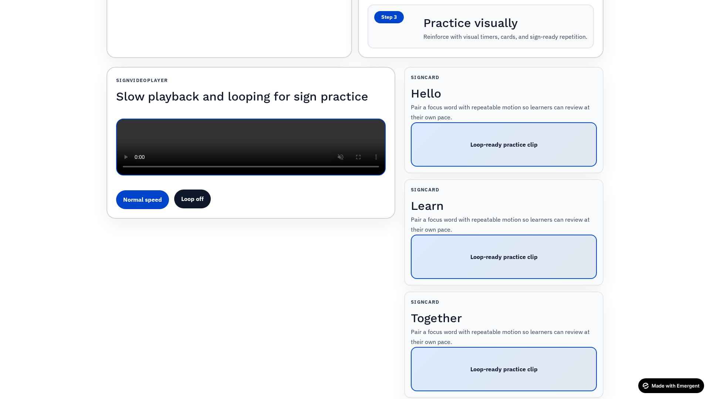
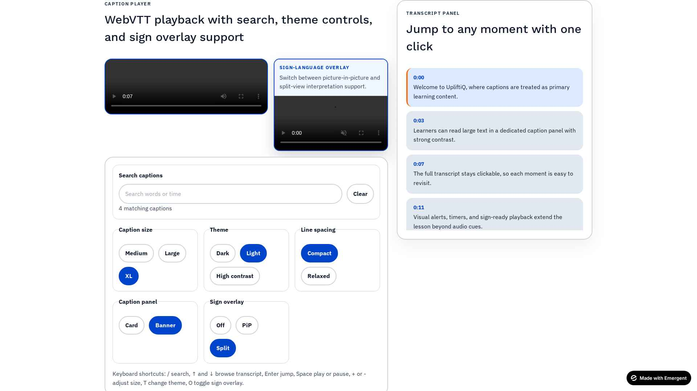
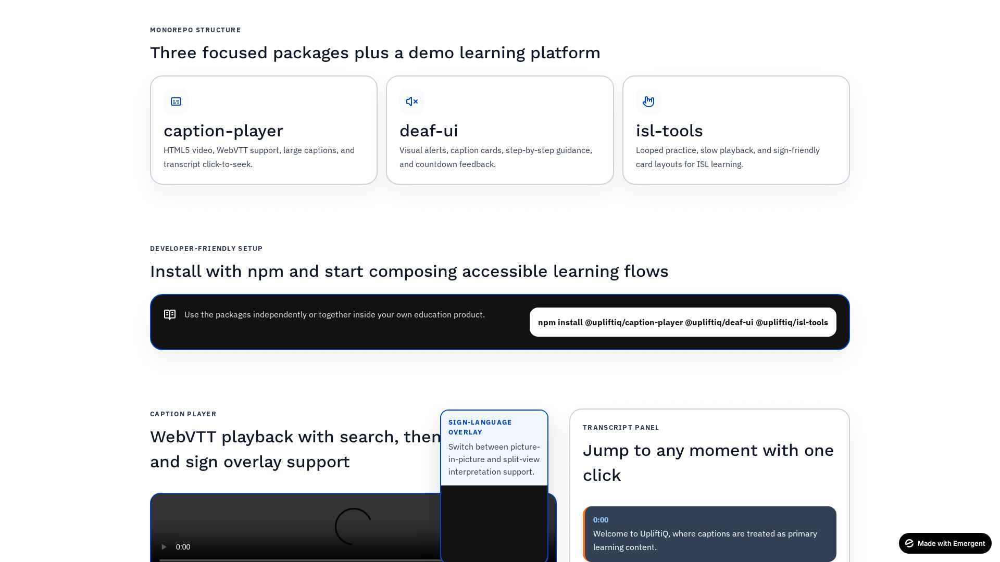
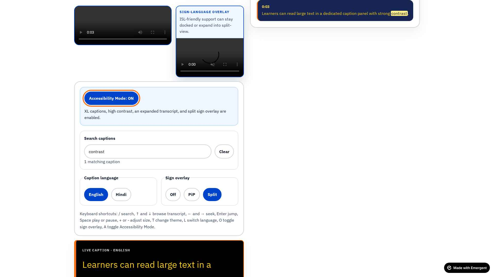
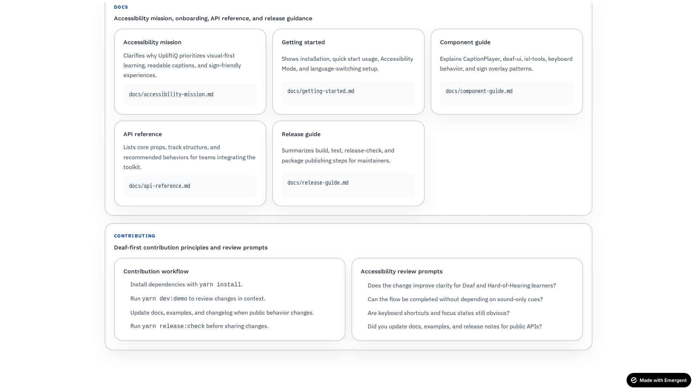

# UpliftiQ Accessibility Toolkit

Open-source React toolkit for building Deaf-friendly learning platforms.

## 🎥 Demo

 
 




## Mission

UpliftiQ helps developers create learning experiences that do not depend on sound-first interactions. The toolkit centers readable captions, visual signals, stepwise learning, and sign-language-ready video patterns so Deaf and Hard-of-Hearing learners can participate with clarity and confidence.

## What is included

- `packages/caption-player` — accessible video player with WebVTT support, transcript sync, caption search, adjustable caption settings, and sign-language overlay support
- `packages/deaf-ui` — visual-first learning components such as alerts, caption cards, step cards, and timers
- `packages/isl-tools` — Indian Sign Language oriented cards and video controls
- `examples/demo-learning-platform` — Vite demo app showing a lesson flow
- `docs/` — mission, setup guidance, and component documentation

## Who this is for

- developers building learning products for Deaf and Hard-of-Hearing users
- education teams who need caption-first lesson patterns
- accessibility-focused teams prototyping sign-friendly learning interfaces

## Project structure

```text
upliftiq-accessibility-toolkit/
  packages/
    caption-player/
    deaf-ui/
    isl-tools/
  examples/
    demo-learning-platform/
  docs/
  README.md
  LICENSE
  CONTRIBUTING.md
```

## Install with npm

```bash
npm install @upliftiq/caption-player @upliftiq/deaf-ui @upliftiq/isl-tools
```

## Release scripts

```bash
yarn build
yarn test
yarn release:check
```

## Usage examples

```tsx
import { CaptionPlayer } from "@upliftiq/caption-player";

export function LessonVideo() {
  return (
    <CaptionPlayer
      video="/videos/lesson.mp4"
      captions={[
        { src: "/captions/lesson-en.vtt", srclang: "en", label: "English", default: true },
        { src: "/captions/lesson-hi.vtt", srclang: "hi", label: "Hindi" }
      ]}
      title="Introduction to Visual Learning"
      signOverlayVideo="/signs/lesson-isl.mp4"
      signOverlayLabel="ISL interpreter"
      defaultCaptionLanguage="en"
    />
  );
}
```

### CaptionPlayer accessibility features

- clickable transcript that jumps video playback time
- caption language switching for English and Hindi
- caption search with highlighted matches
- adjustable caption size, line spacing, and panel style
- dark, light, and high-contrast caption themes
- one-click Accessibility Mode for larger captions, expanded transcript view, and simplified controls
- keyboard shortcuts for search, transcript navigation, playback, language switching, and overlay toggling
- optional sign-language overlay with picture-in-picture and split-view modes

## Package overview

| Package | What it helps with |
| --- | --- |
| `@upliftiq/caption-player` | Video playback, captions, transcript search, Accessibility Mode, language switching |
| `@upliftiq/deaf-ui` | Visual alerts, caption-based cards, step-by-step learning blocks, timers |
| `@upliftiq/isl-tools` | Sign practice cards and sign-friendly video playback |

## Documentation map

- `docs/accessibility-mission.md` — product intent and visual-first accessibility principles
- `docs/getting-started.md` — install steps, quick start, language switching, Accessibility Mode
- `docs/component-guide.md` — feature overview and component behavior guidance
- `docs/api-reference.md` — prop tables and track structure
- `docs/release-guide.md` — build, test, and publish workflow
- `CONTRIBUTING.md` — Deaf-first contribution guidance and review prompts
- `CODE_OF_CONDUCT.md` — community expectations
- `CHANGELOG.md` — release history

```tsx
import { VisualAlert, CaptionCard } from "@upliftiq/deaf-ui";

export function LearningNotice() {
  return (
    <>
      <VisualAlert
        variant="info"
        title="New caption update"
        message="Captions are available in English and Hindi."
      />
      <CaptionCard
        title="Key concept"
        caption="Meaning grows when text, motion, and visuals support each other."
      />
    </>
  );
}
```

```tsx
import { SignCard } from "@upliftiq/isl-tools";

export function SignPractice() {
  return (
    <SignCard
      word="Hello"
      video="/signs/hello.mp4"
      description="Warm greeting used to begin a conversation."
    />
  );
}
```

## Local development

The monorepo is organized with workspaces. The example app uses Vite + React + TypeScript + CSS modules.

```bash
yarn install
yarn dev:demo
```

## Open-source workflow

```bash
yarn build:packages
yarn build:demo
yarn release:check
```

Use these before publishing or sharing the toolkit more widely.

## License

MIT
